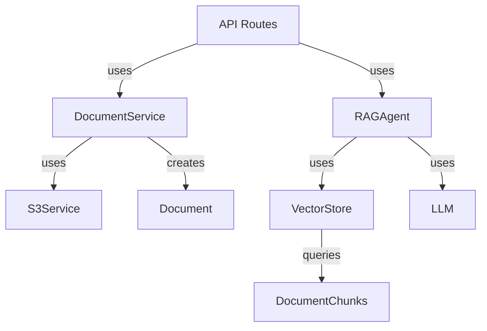

# Document Enquery

An intelligent document processing service built with FastAPI that extracts, analyzes, and stores document content using advanced NLP techniques and vector embeddings, and provides a chat interface for querying the documents.

## 📹 Demo Video

Check out our demo video to see the application in action:

[Watch the Demo Video](https://drive.google.com/file/d/1gnkOJ9j8W6_lcu_uhzbffC8XiFEBQTh-/view?usp=sharing)

## 🚀 Features

- **Document Processing**
  - Multi-format support (PDF, PPTX, XLSX)
  - Text extraction and cleaning
  - Metadata extraction
- **AI-Powered Analysis**
  - Vector embeddings generation
  - Semantic search capabilities
  - Content summarization
- **Storage & Integration**
  - AWS S3 integration for document storage
  - PostgreSQL for metadata and embeddings

## 🛠️ Tech Stack

- **Backend**: FastAPI, Python 3.11
- **Database**: PostgreSQL
- **Storage**: AWS S3
- **ML/AI**: Google Gemini
- **Infrastructure**: Docker

## 📋 Prerequisites

- Python 3.11
- Docker
- AWS Account with S3 access
- PostgreSQL 13+

## 🚀 Quick Start

1. **Clone and Setup**

   ```bash
   git clone [your-repository-url]
   cd [repository-name]
   ```

2. **Environment Setup**

   ```bash
   cd backend
   cp .env.example .env
   # Edit .env with your configurations
   ```

3. **Run with Docker**

   ```bash
   # Build the images
   docker-compose build

   # Run the services
   docker-compose up
   ```

   To rebuild and start (if you make changes):

   ```bash
   docker-compose up --build
   ```

4. **Local Development**

   ```bash
   # Create and activate virtual environment
   python3.11 -m venv venv
   source venv/bin/activate  # Linux/Mac
   # OR
   .\venv\Scripts\activate  # Windows

   # Install dependencies
   pip install -r requirements.txt

   # Start the server
   uvicorn app.main:app --reload
   ```

## Environment Setup

1. Copy the example environment file:

```bash
cd backend
cp .env.example .env
```

2. Update the `.env` file with your credentials:

Required variables:

- `SECRET_KEY`: Generate a secure key (use `openssl rand -hex 32`)
- `POSTGRES_*`: Your PostgreSQL database credentials
- `AWS_*`: Your AWS S3 credentials and bucket name
- `GOOGLE_API_KEY`: Your Google API key for Gemini

Database setup options:

- For local development: Use your local PostgreSQL credentials
- For Docker: Use the default values in docker-compose.yml

Example local database URL format:

```
POSTGRES_SERVER=localhost
POSTGRES_USER=your_username
POSTGRES_PASSWORD=your_password  # Leave empty if no password
POSTGRES_DB=document_enquery
POSTGRES_PORT=5432
```

## 📚 API Documentation

- **Swagger UI**: `http://localhost:8000/docs`
- **ReDoc**: `http://localhost:8000/redoc`

## 📦 Project Structure

```
.
|--| backend/
|  |--| app/
|     |--| api/            # API endpoints and routes
|     |--| core/           # Core configurations and settings
|     |--| crud/           # Database CRUD operations
|     |--| db/             # Database configurations
|     |--| models/         # SQLAlchemy models
|     |--| schemas/        # Pydantic schemas for request/response
|     |--| scripts/        # Utility scripts
|     |--| services/       # Business logic and services
|--| frontend/
|  |--| src/
|     |--| components/     # React components
|     |--| styles/         # CSS and styling files
```

## 🤝 Contributing

1. Fork the repository
2. Create a feature branch
3. Commit your changes
4. Push to the branch
5. Open a Pull Request

## 📞 Support

For support, email [pradnyeshaglawe12@gmail.com] or open an issue on GitHub.

## Low Level Design (LLD)

### Database Schema

#### Tables Structure & Relationships

```sql
-- Users table (Authentication & Authorization)
CREATE TABLE users (
    id UUID PRIMARY KEY DEFAULT uuid_generate_v4(),
    email VARCHAR(255) UNIQUE NOT NULL,
    hashed_password VARCHAR(255) NOT NULL,
    is_active BOOLEAN DEFAULT true,
    created_at TIMESTAMP WITH TIME ZONE DEFAULT CURRENT_TIMESTAMP
);

-- Documents table (Document Management)
CREATE TABLE documents (
    id UUID PRIMARY KEY DEFAULT uuid_generate_v4(),
    user_id UUID REFERENCES users(id) ON DELETE CASCADE,
    title VARCHAR(255) NOT NULL,
    file_url VARCHAR(255) NOT NULL,
    status VARCHAR(50) NOT NULL,  -- processing, ready, failed
    error_message TEXT,
    created_at TIMESTAMP WITH TIME ZONE DEFAULT CURRENT_TIMESTAMP,
    updated_at TIMESTAMP WITH TIME ZONE DEFAULT CURRENT_TIMESTAMP
);

-- Document Chunks table (Vector Storage)
CREATE TABLE document_chunks (
    id UUID PRIMARY KEY DEFAULT uuid_generate_v4(),
    document_id UUID REFERENCES documents(id) ON DELETE CASCADE,
    content TEXT NOT NULL,
    embedding VECTOR(1536),  -- For similarity search
    chunk_index INTEGER NOT NULL,
    created_at TIMESTAMP WITH TIME ZONE DEFAULT CURRENT_TIMESTAMP
);
```

### Class Structure

#### Core Classes

1. **DocumentService**

```python
class DocumentService:
    """Handles document processing and storage"""
    def __init__(self, db: Session):
        self.db = db
        self.s3 = S3Service()

    async def create_document(self, user_id: UUID, title: str, file: UploadFile) -> Document
    async def get_document(self, document_id: UUID) -> Document
    async def get_user_documents(self, user_id: UUID) -> List[Document]
```

2. **RAGAgent**

```python
class RAGAgent:
    """Handles document querying using RAG"""
    def __init__(self, db: Session):
        self.db = db
        self.vector_store = VectorStore(db)
        self.llm = ChatGoogleGenerativeAI()

    async def answer_question(self, question: str, document_ids: List[UUID]) -> Dict
    async def _format_context(self, chunks: List[Dict]) -> str
```

3. **VectorStore**

```python
class VectorStore:
    """Manages document embeddings and similarity search"""
    def __init__(self, db: Session):
        self.db = db

    async def add_texts(self, texts: List[str], document_id: UUID)
    async def similarity_search(self, query: str, document_ids: List[UUID], limit: int) -> List[Dict]
```

### Dependencies and Interactions



### SOLID Principles Implementation

1. **Single Responsibility**

   - Each class has a specific focus (documents, RAG, vectors)
   - Services are separated by domain

2. **Open/Closed**

   - Base classes can be extended without modification
   - New document types can be added without changing existing code

3. **Interface Segregation**

   - Clean separation between document processing and querying
   - Modular design allows for easy testing and maintenance

4. **Dependency Inversion**
   - Services accept dependencies through constructor injection
   - Use of abstract base classes for key components

### Data Normalization

1. **First Normal Form (1NF)**

   - All tables have primary keys
   - No repeating groups

2. **Second Normal Form (2NF)**

   - All non-key attributes depend on the entire primary key

3. **Third Normal Form (3NF)**
   - No transitive dependencies
   - Proper separation of concerns in table structure

### Key Design Patterns

1. **Repository Pattern**

   - Abstraction layer between database and business logic
   - Centralized data access logic

2. **Factory Pattern**

   - Document processor creation
   - Service instantiation

3. **Strategy Pattern**
   - Flexible document processing strategies
   - Configurable RAG implementations
